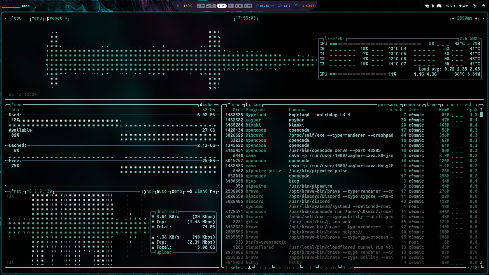

# RAM-to-VRAM System

> Backend-agnostic memory optimization for local LLM inference. Works with Ollama, vLLM, llama.cpp, and LM Studio.

[](LICENSE)
[](https://www.python.org/downloads/)
[](#supported-backends)

## Overview

Run large language models on consumer hardware by intelligently splitting memory between system RAM and GPU VRAM. Auto-detects your inference backend and generates optimal configuration for your specific hardware.



## Supported Backends

| Backend | Setup Script | Port | Best For |
|---------|-------------|------|----------|
| **Ollama** | `backends/ollama/setup-ollama.sh` | 11434 | Quick setup, multi-model |
| **vLLM** | `backends/vllm/setup-vllm.sh` | 8000 | Production, high throughput |
| **llama.cpp** | `backends/llama-cpp/setup-llama-cpp.sh` | 8080 | GGUF models, low VRAM |
| **LM Studio** | `backends/lm-studio/setup-lm-studio.sh` | 1234 | GUI, easy model switching |

## Quick Start

```bash
git clone https://github.com/r13xr13/ram-to-vram-system.git
cd ram-to-vram-system

# Analyze your hardware
python3 scripts/memory_optimizer.py

# Configure your backend (pick one)
sudo bash backends/ollama/setup-ollama.sh
bash backends/vllm/setup-vllm.sh
bash backends/llama-cpp/setup-llama-cpp.sh
bash backends/lm-studio/setup-lm-studio.sh

# Check everything
bash scripts/system-status.sh
```

## Memory Optimizer

Auto-detects your running backend and gives hardware-specific recommendations:

```bash
# Human-readable report
python3 scripts/memory_optimizer.py

# JSON output for scripting
python3 scripts/memory_optimizer.py --json

# Override VRAM detection (for headless/multi-GPU)
python3 scripts/memory_optimizer.py --vram 8192
```

Example output:
```
============================================================
  RAM-to-VRAM Memory Optimizer
============================================================
  Detected Backend: OLLAMA
  Timestamp: 2026-04-03T17:45:00
------------------------------------------------------------
  RAM:    28.3/31.2 GB (90.7%)
  VRAM:   610/4096 MB (14.9%)
  GPU:    40% util | 37°C | 7.5W
  Swap:   0.0/0.0 GB (0.0%)
------------------------------------------------------------
  Recommendations:
  [⚠] RAM: RAM at 90.7% — approaching limit
      → Set context to 32768 tokens
  [✓] VRAM: VRAM at 14.9% — healthy
      → Can offload up to 20 layers
  [ℹ] GPU: GPU utilization at 40% — moderate
      → Increase GPU layers for better performance
------------------------------------------------------------
  Recommended Config (ollama):
    env_vars:
      OLLAMA_NUM_THREADS = 8
      OLLAMA_NUM_CTX = 65536
      OLLAMA_FLASH_ATTENTION = 1
      OLLAMA_KV_CACHE_TYPE = q8_0
      OLLAMA_GPU_LAYERS = 20
      OLLAMA_KEEP_ALIVE = 24h
      OLLAMA_MAX_LOADED_MODELS = 1
============================================================
```

## Architecture

```
┌─────────────────────────────────────────────────────────┐
│                    RAM-to-VRAM                          │
├──────────────────────┬──────────────────────────────────┤
│   CPU (RAM)          │   GPU (VRAM)                     │
│                      │                                  │
│  • Model weights     │  • Compute layers                │
│  • KV cache          │  • Compute buffers               │
│  • Output tokens     │  • Attention computation         │
├──────────────────────┴──────────────────────────────────┤
│                                                         │
│  ┌──────────┐    ┌──────────────┐    ┌────────────────┐ │
│  │ Ollama   │    │    vLLM      │    │   llama.cpp    │ │
│  │ :11434   │    │    :8000     │    │    :8080       │ │
│  └──────────┘    └──────────────┘    └────────────────┘ │
│                                                         │
│  ┌──────────────────────────────────────────────────┐   │
│  │         Memory Optimizer (auto-detect)           │   │
│  │  • Detect backend via process/port scanning      │   │
│  │  • Calculate optimal context/GPU layers          │   │
│  │  • Generate backend-specific config              │   │
│  └──────────────────────────────────────────────────┘   │
└─────────────────────────────────────────────────────────┘
```

## System Requirements

| Component | Minimum | Recommended |
|-----------|---------|-------------|
| CPU | 4 cores | 8+ cores |
| RAM | 16GB | 32GB+ |
| GPU | NVIDIA 2GB VRAM | NVIDIA 4GB+ (GTX 1650+) |
| Storage | 10GB free | 50GB+ (for models) |
| OS | Linux | Arch / Ubuntu |

## Configuration Reference

### Context Window by RAM

| Available RAM | Context Size | RAM Usage |
|---------------|-------------|-----------|
| > 20GB | 128K (131072) | ~8GB |
| > 10GB | 64K (65536) | ~4GB |
| > 5GB | 32K (32768) | ~2GB |
| < 5GB | 16K (16384) | ~1GB |

### GPU Layers by VRAM

| VRAM | GPU Layers | Example GPU |
|------|-----------|-------------|
| ≥ 24GB | 99 (full) | RTX 3090/4090 |
| ≥ 16GB | 80 | RTX 4080 |
| ≥ 12GB | 60 | RTX 3060 12GB |
| ≥ 8GB | 40 | RTX 3070/4060 Ti |
| ≥ 6GB | 30 | RTX 3060 6GB |
| ≥ 4GB | 20 | GTX 1650 |
| < 4GB | 10 | GTX 1050 Ti |

### KV Cache Quantization

| Type | Memory | Quality |
|------|--------|---------|
| f16 | 2× baseline | Best |
| q8_0 | 1× baseline | Near-lossless |
| q4_0 | 0.5× baseline | Good |

## Project Structure

```
ram-to-vram-system/
├── scripts/
│   ├── memory_optimizer.py    # Backend-agnostic memory analysis
│   └── system-status.sh       # One-command health check
├── backends/
│   ├── ollama/
│   │   └── setup-ollama.sh    # Ollama systemd config
│   ├── vllm/
│   │   └── setup-vllm.sh      # vLLM launch config generator
│   ├── llama-cpp/
│   │   └── setup-llama-cpp.sh # llama.cpp server config
│   └── lm-studio/
│       └── setup-lm-studio.sh # LM Studio JSON config
├── config/                    # Generated launch configs
├── docs/
│   ├── INSTALL.md
│   ├── CONFIG.md
│   └── TROUBLESHOOTING.md
├── LICENSE
├── .gitignore
└── README.md
```

## Troubleshooting

See [docs/TROUBLESHOOTING.md](docs/TROUBLESHOOTING.md) for detailed solutions.

**Quick fixes:**

| Issue | Fix |
|-------|-----|
| No backend detected | Start Ollama/vLLM/llama.cpp first |
| OOM on GPU | Reduce `--n-gpu-layers` or `--gpu-memory-utilization` |
| High RAM | Lower context window, use q4_0 KV cache |
| Slow inference | Enable flash attention, increase GPU layers |

## Contributing

See [CONTRIBUTING.md](CONTRIBUTING.md) for development guidelines.

## License

MIT — see [LICENSE](LICENSE).

<div align="center">

**Ram-2-VRam-System** by [HEAVYBUTTER](https://github.com/r13xr13)

</div>
